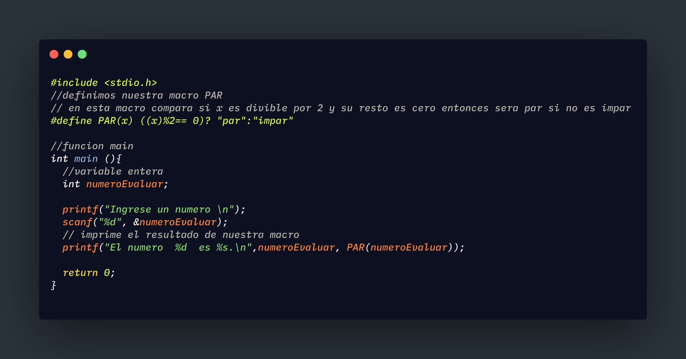
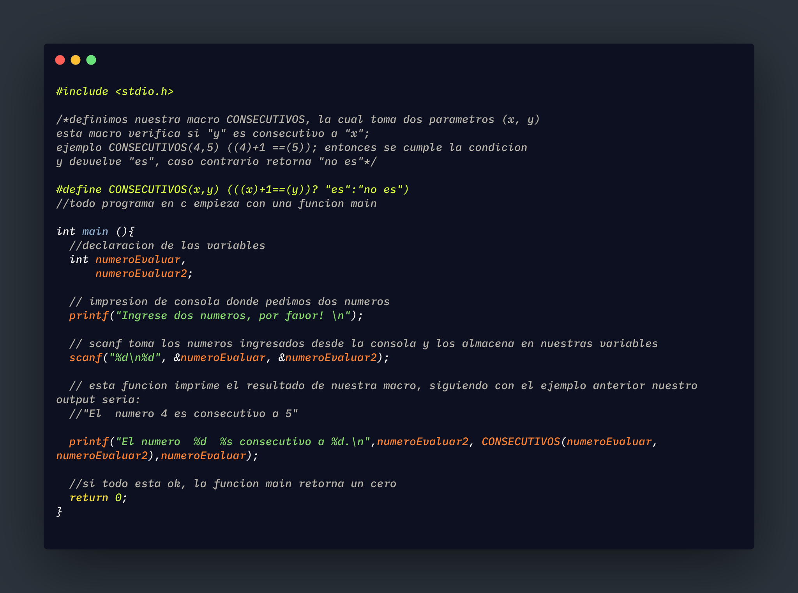
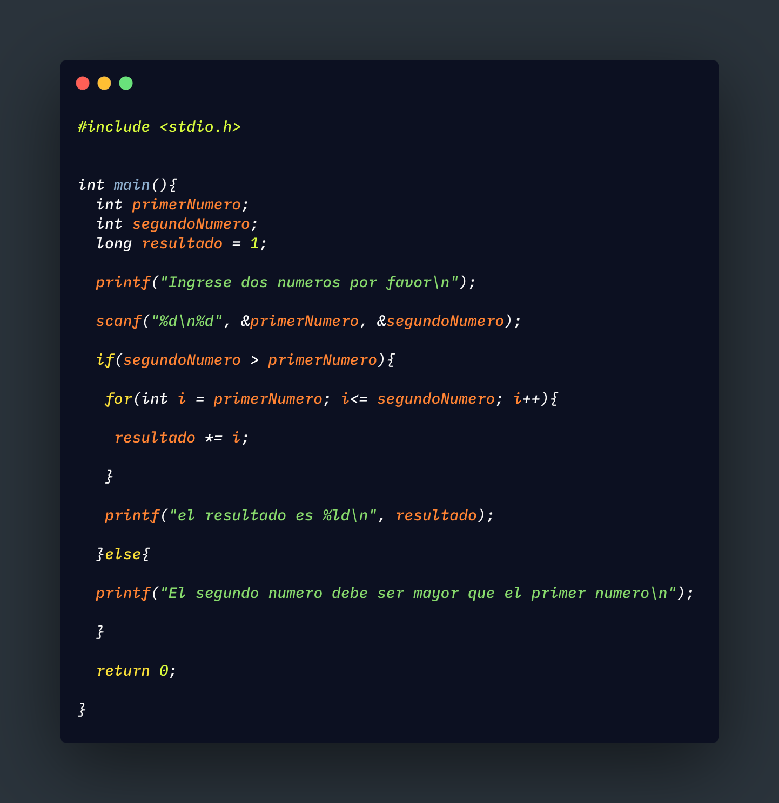
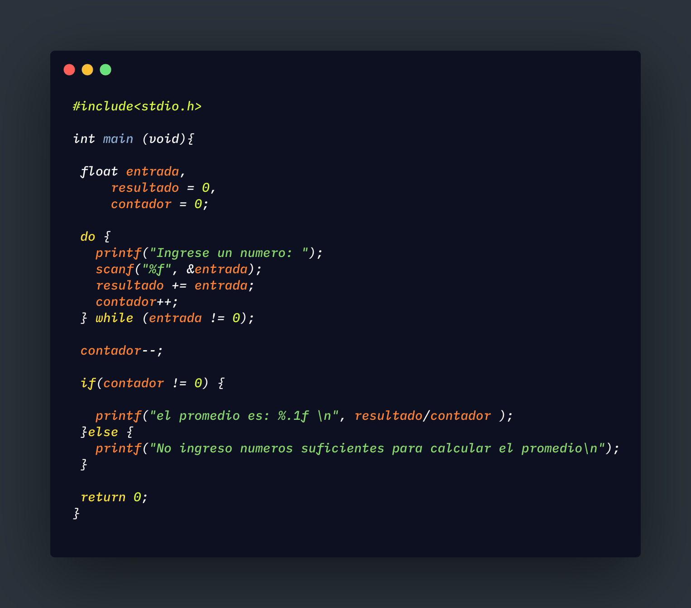
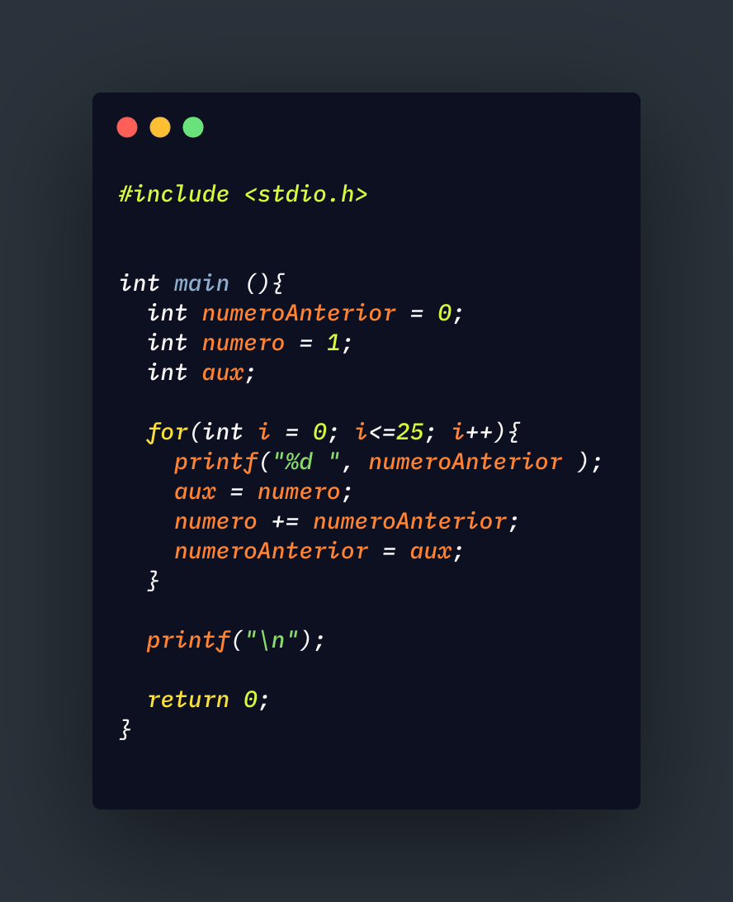
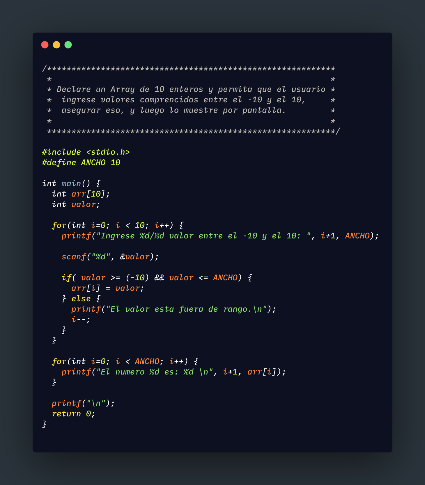
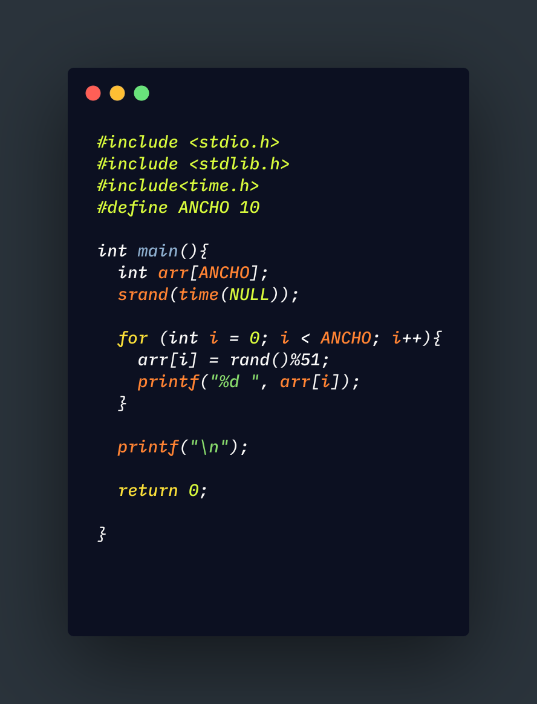
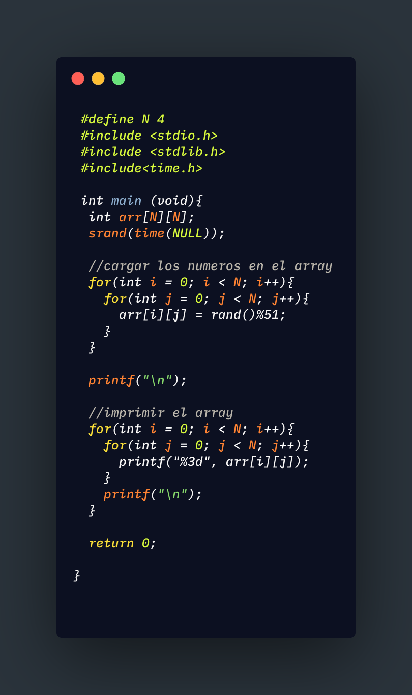
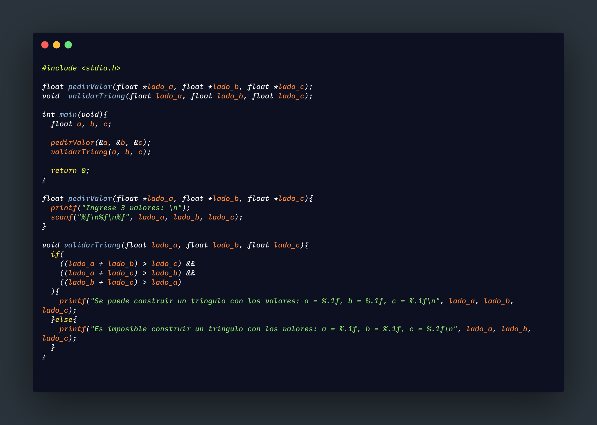
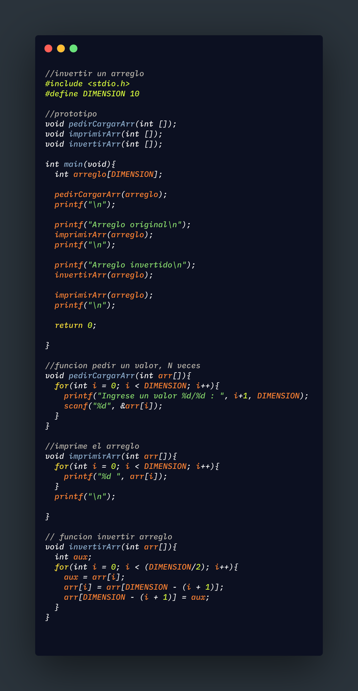

# Tarea_Macu
Este repositorio contiene las practicas del taller de programacion :pencil2:

# CONTENIDO:

 1. Macros

 2. Bucles

 3. Arrays

 4. Funciones

# 1. MACROS

Nivel 1:

Nivel 2:

Nivel 3:

# 2. BUCLES

Nivel 1:

Nivel 2:

Nivel 3:

# 3. ARRAYS

Nivel 1:

Nivel 2:

Nivel 3:

# 4. FUNCIONES

Nivel 1:

Nivel 2:

